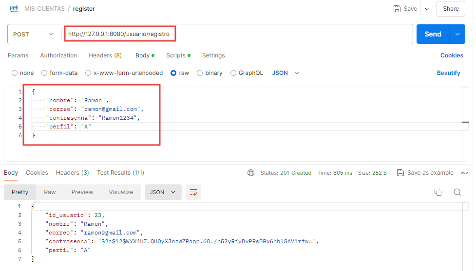

# Ktor REST API Proyecto ciclo DAM

Rest Api para proyecto MisCuentas del ciclo DAM en MonteCastelo.

- [Ktor REST API para proyecto MisCuentas](#ktor-rest-api-proyecto-ciclo-dam)
  - [Acerca de..](#acerca-de)
    - [Caracteristicas](#caracteristicas)
    - [Librerias](#librerias)
    - [Aplicaciones que forman parte de este proyecto](#aplicaciones-que-forman-parte-de-este-proyecto)
  - [Instalacion](#instalacion)
    - [Desplegar servicio en Docker](#desplegar-servicio-en-docker)
    - [Desplear servicio en IDE](#desplegar-servicio-en-ide)
  - [Uso](#uso)
  - [Documentaciones](#documentaciones)
    - [Documentacion del codigo](#documentacion-del-codigo)
    - [Documentacion del API REST](#documentacion-del-api-rest)
  - [Autor](#autor)
      - [Contacto](#contacto)
  - [Contribucion](#contribucion)
  - [Licencia](#licencia)

## Acerca de..
Este REST APi esta desarrollado para el proyecto de fin de ciclo 'MisCuentas'. Ciclo DAM cursado en el instituto [MonteCastelo](https://www.fomento.edu/montecastelo/) de Vigo. 
El servicio WEB nos permite comunicarnos con nuestra BBDD MySql a traves del protocolo HTTP, recibiendo una respuesta en formato JSON. 
El objetivo de este servicio es dar soporte tanto a la aplicacion movil como de escritorio, ambas creadas como parte del mismo proyecto.

### Caracteristicas
Para el desarrollo de este servicio usé la Programacion Orientada a Ferrocarriles o ROP por sus siglas en ingles (Railway oriented programming). Esta se basa en manejar el flujo de datos y errores lo mas eficientemente posible. 
La idea principal es pensar en el flujo de datos como un tren que viaja a lo largo de las vías. Si todo va bien, el tren sigue su camino sin interrupciones. Si ocurre un error, el tren cambia de vía hacia un flujo de error. 
El programa se estructura en dos vías: una para el flujo de éxito y otra para el flujo de error, por lo que, las funciones reciben un valor y devuelven un resultado que indica si el proceso fue exitoso o fallido. 
[Saber mas](#https://altenwald.org/2018/07/17/programacion-orientada-a-ferrocarril/)

### Librerias
En este proyecto se utilizan los siguientes plugins, librerias y servicios:

- Exposed (ORM para Ktor)
- Serialization (Serializacion para Ktor)
- Cors (Permite y/o deniega origenes cruzados)
- Dotenv (Accede a las variables de entorno ocultas en archivo .env)
- BCrypt (Encriptacion de contraseñas)
- Koin (Injeccion de dependencias)
- JWT (Generacion y verificacion del token de acceso)
- ShadowJar (Genracio de .jar)
- HikariCP (Agrupacion de conexiones)
- Swagger (Documenta la API)
- Dokka (Documenta el codigo)

### Aplicaciones que forman parte de este proyecto:
- #### [APP Movil MisCuentas](https://github.com/LeoCare/MisCuentas)
- #### [APP Escritorio TodoCuentas](https://github.com/LeoCare/MisCuentas_desk)
- #### [Servicio Windows](https://github.com/LeoCare/MailMyService)

 

Los proyectos tienen su repositorio en GitHub. 
<b>Para acceder a ellos no olvides solicitarme una clave de acceso al repositorio.</b> [Solicitar acceso](#contacto)

## Instalacion
El proyecto esta desarrollado para ser subido a un contenedor Docker, al igual que la imagen de la BBDD en Mysql. Puedes ver los archivos docker-compose.yml y Dockerfile en la raiz del proyecto, para este proposito. 
De todas maneras, se puede ejecutar desde el IDE de java que utilices. Aqui te explico ambas maneras de poder hacer uso de este API REST.

<b>IMPORTANTE: este API utiliza conexion SSL con claves autogeneradas (no recomendado pero util en este caso), asi como claves de conexion a la BBDD y Token de acceso. 
Estos datos sencibles se almacenan en un archivo '.env' el cual se excluye en el repositorio, debes solicitarmelo y colocarlo en la raiz del proyecto!</b> 
[Solicitar archivo .env](#contacto)...si ya lo tienes evita esto.

### DESPLEGAR SERVICIO EN DOCKER
Esta manera de deplegar el servicio dependerá de tener un contenedor, con la BBDD MySql, en la misma intancia de Docker.
  
#### Pasos:
1. En el archivo .env debes descomentar la linea con la etiqueta 'DB_URL=jdbc:mysql://...', tal como en la imagen:</b>

  

2. Abre una terminal en el mismo IDE de Java y ejecuta este comando para generar el .jar del proyecto:

>./gradlew buildFatJar

  
3. Luego, crea el contenedor del API ejecutando estes comando desde el servidor donde tengas docker. Para ello ubicate en la raiz de este proyecto y ejecuta:

>docker-compose up

  
4. Una vez creados e iniciados ambos contenedores (API y MySql) colocales una red interna, ya que ambos deben compartir la misa red de la instancia de Docker. Para ello crea un rango de red en docker y asignalas a ambos contenedores.
   
     

6. Prueba la instalacion desde Postman (por ejemplo)
   
>https://192.168.7.3:8443/usuario/registro.

  
### DESPLEGAR SERVICIO EN IDE

#### Pasos:
1. En el archivo .env debes descomentar la linea con la etiqueta <b>'DB_URL=jdbc:mysql://...'</b>
   
     
2. Ubicate en el archivo 'Application.kt' del proyecto y correlo (RUN).
   
     
3. Pruebalo desde Postman (por ejemplo)
   
>https://127.0.0.1:8443/usuario/registro.

  
*Si algo falla, recuerda abrir los puertos asignados, revisa tu acceso a la bbdd o ten en cuenta que puedes acceder por Http(8080) o Https(8443). 
Tambien puedes modificar lo que sea necesario para que se ajuste a tus necesidades.

## Uso
Obviando la instacion descripta en el apartado anterior, debes tener en cuenta los siguiente antes de probar la API:

### Seguridad
El servicio utiliza certificados autogenerados para la conexion Https, lo recomendado es que haya un servidor proxy inverso por delante, pero para el caso de uso, esto es mas que suficiente. 
Ademas, en ciertas solicitudes GET, PUT o DEL se requiere de un token en la comunicacion para garantizar los permisos de dicha solicitud. **Como adjuntar el token, obtenido en el logeo, desde Postman:** 

### Archivo faltante
Como se menciona al inicio de este documento, las claves de generacion SSL y Token estan en un archivo '.env' el cual se ignora al subir el repositorio a travez del .gitignore. 
Este archivo es necesario para el funcionamiento del servicio, no olvides [solicitarlo](#contacto).

### Probarlo en local
Antes de cualquier prueba, debes realizar los cambios necesarios segun tu BBDD, rango de IP, puertos y demas configuraciones. 

Ahora si....
### Como probarlo
Para este ejemplo se usa el protocolo Http en localhost.

1. [Despegar el servicio](#desplegar-servicio-en-ide)
2. Arrancar Postman
3. Registrar usuario (POST):
   
4. Login del usuario registrado (POST):
   
5. Obtener mis datos de usuario (GET with Token):
   
6. Buscar usuarios donde c(columna) tenga q(consulta) (GET with Token): 
Usuarios que tengan 'leo' en el 'nombre'... 
    
7. Actualizar mis datos (PUT whit Token): 
Actualizar mi correo por ejemplo...
   
8. Eliminar un usuario (DEL whit Token):
   

*Estos son solo unos ejemplos, puedes realizar mas pruebas desde la documentacion de la API, tal como lo explico en el apartado [Documentacion del API REST](#documentacion-del-api-rest)

## Documentaciones
La documentacion se divide en dos partes, la documentacion del codigo y la documentacion de la interfaz de API REST.

### Documentacion del codigo
La documentacion del codigo se realizó comentando cada clase, ruta, repositorio y demas, con una sintaxis en concreto para ser reconocida por [Dokka](https://kotlinlang.org/docs/dokka-introduction.html). 
Esta libreria genera la documentacion en varios formatos, en mi caso se uso Markdown para acceder desde el mismo repositorio en el que estas. 
Puedes ver y seguir toda la estructura de la aplicacion desde el siguiente enlace: 
[Ver documentacion](docs/gfm/index.md)

Imagen de ejemplo 

### Documentacion del API REST
Para el codigo del servicio se uso la libreria Swagger. Esta permite diseñar, documentos, **y puede que lo mas interesante, consumir APIs.**
Genera documentacion interactiva en HTML que permite probar los EndPoits directamente desde el navegador.
Para generarlo he comentado todas las rutas con la sintaxis requeridas por la libreria, de manera que la reconozca y genere dicha documentacion. 
Pueder ver y consumir las APIs arrancando el servicio y pinchando en el enlace o escribiendo el código en tu navegador: 
[Ver codigo](http://127.0.0.1:8080/swagger/index.html)
>http://127.0.0.1:8080/swagger

Imagen de ejemplo

## Autor
Mi nombre es <b>Leonardo David Care Prado</b>, soy tecnico en sistemas y desarrollador de aplicaciones multiplataforma, o eso espero con este proyecto...jjjjj. 
A fecha de este año (2024) llevo 4 años realizando trabajos de desarrollo para la misma empresa, ademas de soporte y sistemas. 
Estos desarrollos incluyen lenguajes como Html, C#, Xamarin, Oracle, Java y Kotlin.

### Contacto
Para cualquier consulta o aporte puedes comunicarte conmigo por correo 
[leon1982care@gmail.com](https://mail.google.com/mail/u/0/?pli=1#inbox)

 

## Contribucion
Gracias a todos los que aporten nuevas ideas de como mejorar mi proyecto. Sientance libres de participar, cambiar u opinar sobre el mismo. 
Solo pido que al crear la rama, esta comience por 'contribucion/lo_que_aporteis'. Y, el commit sea claro y descriptivo. 
En caso de necesitar documentar los nuevos cambios, seguir con el uso de las libreria mensionada en el apartado [Documentaciones](#documentaciones). 
Muchisimas gracias a todos!

## Licencia
Este repositorio y todo su contenido estan bajo la licencia de **Creative Commons**. Solo pido que si haces uso de ella, me cites como el autor. 
 

<a rel="license" href="http://creativecommons.org/licenses/by-nc-sa/4.0/">Creative Commons
Attribution-NonCommercial-ShareAlike 4.0 International License</a>.